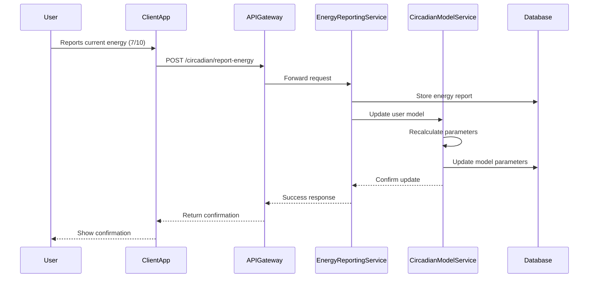
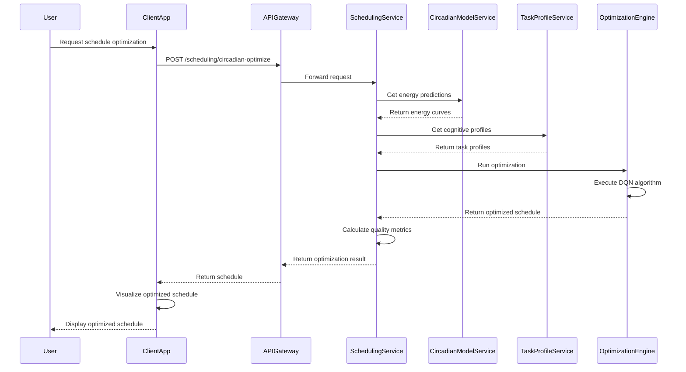

# Epic 4: Practical Examples & Implementation Guide
# Dynamic Schedule Rebalancing with Circadian Rhythm Optimization

## Visual Reference Guide

### Energy Curve Visualization

The following graph shows a typical user's energy curve with different cognitive dimensions:

```
Energy Level
10 |                                           
   |                   ⋰•⋰                     
 8 |            ⋰•⋰    •  •                    
   |           •   •  •    •  ⋰•⋰              
 6 |          •     ••      ••   •             
   |    ⋰•⋰  •      Focus    •   •   ⋰•⋰      
 4 |   •   ••                 •   •⋰•   •     
   |  •    •                   •••     ••     
 2 | •    •  Creative           Executive     
   |•    •                                     
 0 +-------------------------------------------
    00:00  06:00  12:00  18:00  00:00
                 Time of Day
```

### Task-Energy Matching Matrix

This matrix shows how different task types align with energy states:

```
         | High Focus | High Creative | High Executive Function
---------+------------+--------------+------------------------
Complex  |    ✓✓✓     |      ✓       |          ✓✓
---------+------------+--------------+------------------------
Creative |     ✓      |     ✓✓✓      |           ✓
---------+------------+--------------+------------------------
Admin    |     ✗      |      ✓       |          ✓✓
---------+------------+--------------+------------------------
Learning |    ✓✓✓     |      ✓✓      |           ✓
---------+------------+--------------+------------------------
Planning |     ✓      |      ✓✓      |         ✓✓✓
```
✓✓✓ = Ideal match, ✓✓ = Good match, ✓ = Acceptable match, ✗ = Poor match

### Optimization Process Flow

This diagram illustrates the complete schedule optimization process:

```
┌───────────────┐     ┌────────────────────┐     ┌──────────────────┐
│ Collect Data  │────►│ Generate Energy    │────►│ Classify Tasks   │
│               │     │ Prediction Curve   │     │ by Cognitive Load│
└───────────────┘     └────────────────────┘     └────────┬─────────┘
                                                          │
┌───────────────┐     ┌────────────────────┐     ┌───────▼─────────┐
│ Apply         │◄────│ Create Optimized   │◄────│ Run DQN         │
│ Schedule      │     │ Schedule           │     │ Optimization    │
└───────┬───────┘     └────────────────────┘     └──────────────────┘
        │
        │             ┌────────────────────┐     ┌──────────────────┐
        └────────────►│ Collect Task       │────►│ Update Models    │
                      │ Completion Data    │     │ with Feedback    │
                      └────────────────────┘     └──────────────────┘
```

## Real-World Usage Scenarios

### Scenario 1: Morning Focus Writer

**User Profile:**
- ADHD adult with peak focus in mornings (8-11 AM)
- Creative energy spike in late afternoon (3-5 PM)
- Executive function dip after lunch (1-3 PM)

**Tasks to Schedule:**
1. Write product documentation (2 hours, high focus)
2. Brainstorm marketing ideas (1 hour, high creative)
3. Email inbox processing (45 minutes, low focus, medium executive function)
4. Team meeting (1 hour, fixed at 2 PM)
5. Budget review (1 hour, high executive function)

**Optimization Result:**

```
Time       | Task                    | Energy Alignment       | Notes
-----------+-------------------------+------------------------+-------------------
8:00-10:00 | Write documentation     | Focus: 9.2/10          | Scheduled during peak focus
10:15-11:00| Email inbox processing  | Executive: 6.5/10      | Administrative task in decent EF window
11:00-12:00| Budget review           | Executive: 7.8/10      | High EF task during strong EF period
12:00-1:00 | Lunch                   | --                     | Break during natural energy dip
1:00-2:00  | Free buffer time        | All metrics low        | Low energy period left as buffer
2:00-3:00  | Team meeting            | Fixed appointment      | Unavoidable meeting during low point
3:15-4:15  | Brainstorm marketing    | Creative: 8.7/10       | Creative task during creative peak
```

**User Feedback:**
- 95% completion rate (compared to typical 70%)
- Budget review completed in 50 minutes instead of usual 75 minutes
- Documentation quality rated as "excellent" by manager

### Scenario 2: Night Owl Developer

**User Profile:**
- ADHD developer with peak focus from 8-11 PM
- Morning executive function strength (9-11 AM) 
- Creative energy biphasic (11 AM-1 PM and 6-8 PM)

**Tasks to Schedule:**
1. Code complex algorithm (3 hours, high focus)
2. Design system architecture (2 hours, high creative, high executive function)
3. Code review (1 hour, medium focus)
4. Daily standup (30 minutes, fixed at 9:30 AM)
5. Documentation update (1 hour, medium focus)

**Optimization Result:**

```
Time       | Task                    | Energy Alignment       | Notes
-----------+-------------------------+------------------------+-------------------
9:00-9:30  | Buffer time             | Ramp-up period         | Preparation time before meeting
9:30-10:00 | Daily standup           | Fixed appointment      | Required meeting
10:00-12:00| Design architecture     | Executive: 8.5/10      | Uses morning executive function strength
12:00-1:00 | Documentation update    | Focus: 6.2/10          | Moderate focus task during decent period
1:00-2:00  | Lunch/Break             | Energy transition      | Break during natural transition
2:00-3:00  | Code review             | Focus: 5.8/10          | Less demanding focus task
3:00-6:00  | Free time/Admin tasks   | Low overall metrics    | Low energy period
6:00-7:00  | Dinner                  | --                     | Break before evening session
8:00-11:00 | Code complex algorithm  | Focus: 9.3/10          | Most demanding task during peak focus
```

**User Feedback:**
- Algorithm implementation completed 30% faster than previous similar tasks
- Reported less exhaustion at end of day
- Architecture design considered more innovative than usual work

## Implementation Checklist

### Phase 1: Core Infrastructure Setup (2 weeks)

- [ ] Set up PostgreSQL database with required schemas
- [ ] Configure MongoDB collections for model storage
- [ ] Implement Redis caching infrastructure
- [ ] Create basic API endpoints (without optimization logic)
- [ ] Set up monitoring and logging infrastructure
- [ ] Implement authentication and authorization

### Phase 2: Base Models Implementation (3 weeks)

- [ ] Implement CircadianRhythmModel with default parameters
- [ ] Create TaskCognitiveProfiler with basic classification
- [ ] Implement energy curve prediction with population defaults
- [ ] Set up data collection pipeline for user energy reports
- [ ] Create visualization components for energy curves

### Phase 3: Optimization Engine (4 weeks)

- [ ] Implement DQN model framework
- [ ] Develop state and action representation for scheduling
- [ ] Create reward function incorporating energy alignment
- [ ] Implement schedule constraint processing
- [ ] Develop incremental rebalancing algorithms
- [ ] Set up offline training pipeline for base models

### Phase 4: API & Integration (3 weeks)

- [ ] Complete RESTful API implementation
- [ ] Integrate with authentication services
- [ ] Implement calendar service integration
- [ ] Create notification service integration
- [ ] Develop comprehensive API documentation

### Phase 5: Testing & Optimization (2 weeks)

- [ ] Perform load testing and optimization
- [ ] Conduct user acceptance testing
- [ ] Implement feedback collection systems
- [ ] Fine-tune algorithms based on test data
- [ ] Documentation and training materials

## Sample Implementation Sequences

### Energy Report Submission Flow



### Schedule Optimization Request Flow



## Performance Benchmarks

| Operation | Target Response Time | Load Capacity |
|-----------|----------------------|--------------|
| Energy Report Submission | < 200ms | 500 req/sec |
| Energy Curve Retrieval | < 100ms | 1000 req/sec |
| Task Analysis | < 300ms | 300 req/sec |
| Schedule Optimization (10 tasks) | < 2s | 50 req/sec |
| Schedule Optimization (50 tasks) | < 8s | 10 req/sec |
| Schedule Application | < 500ms | 100 req/sec |

## Common Error Scenarios and Handling

### Insufficient Data Handling

When a user has limited energy data:

```typescript
function getEnergyPredictionsWithFallbacks(userId, date) {
  // Step 1: Try user-specific predictions
  const userDataPoints = await getUserDataPointCount(userId);
  
  if (userDataPoints >= MINIMUM_DATA_POINTS) {
    try {
      return await getPersonalizedEnergyPredictions(userId, date);
    } catch (error) {
      logger.warn(`Personal prediction failed: ${error.message}`);
      // Fall through to fallbacks
    }
  }
  
  // Step 2: Try demographic-based predictions
  const demographicInfo = await getUserDemographics(userId);
  if (demographicInfo) {
    try {
      return await getDemographicEnergyPredictions(demographicInfo, date);
    } catch (error) {
      logger.warn(`Demographic prediction failed: ${error.message}`);
      // Fall through to final fallback
    }
  }
  
  // Step 3: Use population defaults with confidence indicator
  const defaultPredictions = await getDefaultEnergyPredictions(date);
  return {
    predictions: defaultPredictions,
    confidence: 'LOW',
    message: 'Using population defaults. Please report energy levels to improve predictions.'
  };
}
```

### Optimization Quality Assessment

Evaluating whether an optimization needs manual review:

```typescript
function assessOptimizationQuality(optimization) {
  const flags = [];
  
  // Check if high-focus tasks are in low-focus periods
  const highFocusTasks = optimization.tasks.filter(t => t.focus_required > 7);
  for (const task of highFocusTasks) {
    const scheduledItem = optimization.schedule.find(s => s.task_id === task.id);
    if (scheduledItem && scheduledItem.energy_level < 5) {
      flags.push({
        type: 'FOCUS_MISMATCH',
        task_id: task.id,
        scheduled_energy: scheduledItem.energy_level,
        required_energy: task.focus_required
      });
    }
  }
  
  // Check for task clustering (too many tasks in short period)
  const hourlyTaskCount = countTasksByHour(optimization.schedule);
  const overloadedHours = Object.entries(hourlyTaskCount)
    .filter(([hour, count]) => count > 3)
    .map(([hour, count]) => ({ hour, count }));
    
  if (overloadedHours.length > 0) {
    flags.push({
      type: 'TASK_OVERLOAD',
      overloaded_hours: overloadedHours
    });
  }
  
  // Add more quality checks as needed
  
  return {
    flags,
    needs_review: flags.length > 0,
    quality_score: calculateQualityScore(optimization, flags)
  };
}
```

## User Experience Optimizations

### Progressive Data Collection

To avoid overwhelming users when first onboarding:

1. **Day 1**: Collect basic work hours and simple energy pattern questionnaire
2. **Days 2-5**: Request energy level feedback 2-3 times daily at key transitions
3. **Days 6-14**: Introduce task completion feedback with simple 1-5 ratings
4. **Week 3+**: Full feedback collection with detailed metrics

### Feedback Collection UI Examples

**Minimal Energy Report**:
```
+-------------------------------------+
|  How's your energy right now?       |
|                                     |
|  Low [1] [2] [3] [4] [5] High       |
|                                     |
|  [Skip] [Submit]                    |
+-------------------------------------+
```

**Detailed Energy Report**:
```
+-------------------------------------+
|  Energy Check-in                    |
|                                     |
|  Overall Energy:  [1][2][3][4][5]   |
|  Focus Capacity:  [1][2][3][4][5]   |
|  Creative Energy: [1][2][3][4][5]   |
|                                     |
|  What are you doing?                |
|  [Working] [Meeting] [Break] [Other]|
|                                     |
|  Add Note: [____________]           |
|                                     |
|  [Skip] [Submit]                    |
+-------------------------------------+
```

## Implementation Pitfalls and Solutions

### Common Implementation Challenges

1. **Cold Start Problem**
   - **Challenge**: New users have no energy data for predictions
   - **Solution**: Implement layered fallbacks (demographics → population defaults) and prioritize data collection

2. **Overfitting to Limited Data**
   - **Challenge**: Models may overfit to limited early user data
   - **Solution**: Use Bayesian methods with strong priors that gradually relax as more data is collected

3. **Schedule Disruption Handling**
   - **Challenge**: User may become frustrated if schedules change frequently
   - **Solution**: Implement stability weighting that balances optimization with consistency

4. **Integration with External Calendars**
   - **Challenge**: External calendar systems have varying APIs and capabilities
   - **Solution**: Create an abstraction layer with adapter pattern to normalize calendar interactions

5. **Task Duration Uncertainty**
   - **Challenge**: Users often underestimate task duration
   - **Solution**: Implement automatic duration adjustment based on historical completion data

### Code Patterns for Robust Implementation

**Graceful Degradation Example**:

```typescript
class CircadianOptimizationService {
  async optimizeSchedule(request, options = {}) {
    try {
      // Try full optimization
      return await this.fullOptimization(request);
    } catch (error) {
      logger.warn(`Full optimization failed: ${error.message}`);
      
      if (options.allowFallbacks) {
        try {
          // Try simplified optimization
          logger.info('Attempting simplified optimization');
          return await this.simplifiedOptimization(request);
        } catch (secondError) {
          logger.warn(`Simplified optimization failed: ${secondError.message}`);
          
          // Last resort - basic priority-based scheduling
          logger.info('Falling back to basic scheduling');
          return await this.basicPriorityScheduling(request);
        }
      }
      
      // If no fallbacks allowed or all fallbacks failed
      throw new OptimizationError('Schedule optimization failed', { cause: error });
    }
  }
}
```

## Measuring Success

### Key Performance Indicators

1. **User Engagement Metrics**:
   - Energy reporting frequency (target: >3 reports/day)
   - Schedule optimization usage (target: >2 optimizations/week)
   - Feedback submission rate (target: >80% of completed tasks)

2. **Productivity Metrics**:
   - Task completion rate (target: 15% improvement)
   - Task duration accuracy (target: <20% deviation from estimates)
   - Rescheduling frequency (target: <10% of scheduled tasks)

3. **Model Performance Metrics**:
   - Energy prediction accuracy (target: <1.5 point error on 10-point scale)
   - Task categorization accuracy (target: >80% validated by user feedback)
   - Schedule quality rating (target: avg >4.0/5.0)

### Success Validation Methods

1. **A/B Testing Framework**:
   - Test groups: No optimization vs. Basic optimization vs. Circadian optimization
   - Duration: 4 weeks minimum
   - Key metric: Task completion rates
   
2. **User Interviews**:
   - Conduct monthly interviews with 5-8 users
   - Focus on pain points and unexpected benefits
   - Gather qualitative feedback on energy-task alignment

3. **Longitudinal Analysis**:
   - Track individual user improvement over 60/90/180 days
   - Measure convergence of model predictions with reported energy
   - Analyze productivity trend lines across user cohorts 