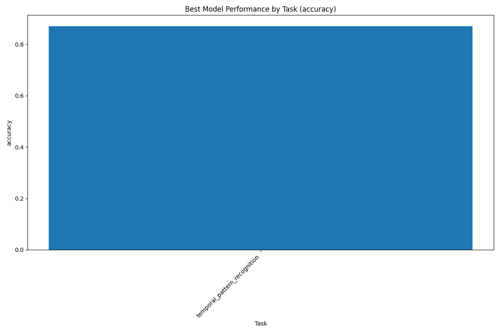
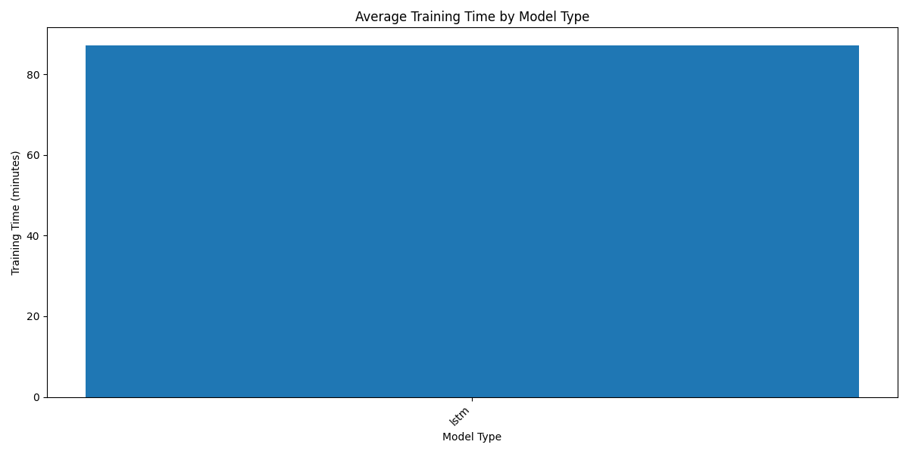

# ML Project Analytics Dashboard
**Generated on:** 2025-03-06

## Project Summary

| Metric                  | Value        |
|:------------------------|:-------------|
| Total Models            | 1            |
| Total Experiments       | 1            |
| Tasks Covered           | 1            |
| Model Types             | lstm         |
| Latest Model            | 2025-03-06   |
| Avg. Training Time      | 87.2 minutes |
| Experiment Success Rate | 100.0%       |

## Best Models by Task

### temporal_pattern_recognition

**Model ID:** tpr_model
**Version:** v1.0.0
**Created:** 2025-03-06T10:30:00

#### Metrics

| Metric    |   Value |
|:----------|--------:|
| accuracy  |   0.87  |
| precision |   0.84  |
| recall    |   0.85  |
| f1_score  |   0.845 |
| auc       |   0.91  |

#### Hyperparameters

| Hyperparameter   |   Value |
|:-----------------|--------:|
| embedding_dim    | 128     |
| hidden_dim       | 256     |
| num_layers       |   2     |
| dropout          |   0.2   |
| learning_rate    |   0.001 |
| batch_size       |  32     |
| epochs           |  50     |

## Performance Trends

### Model Performance by Task

### Training Time by Model Type

## Hyperparameter Analysis

## Model Improvement Analysis

No improvement data available.
## Recommendations

- Consider using ensemble methods to potentially improve model performance.
- Optimize training pipeline for lstm models (average training time: 87.2 minutes).
- Implement regular model monitoring to detect performance degradation over time.
- Consider A/B testing the best models in production to validate offline metrics.
