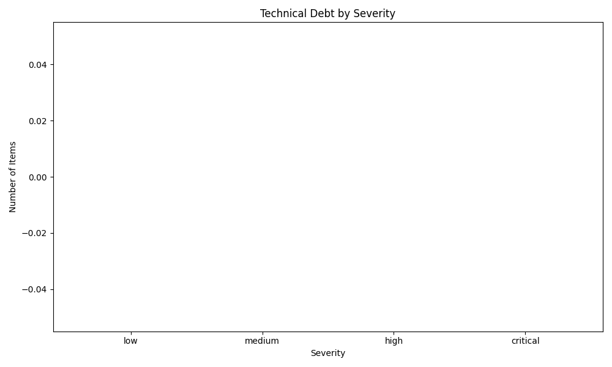
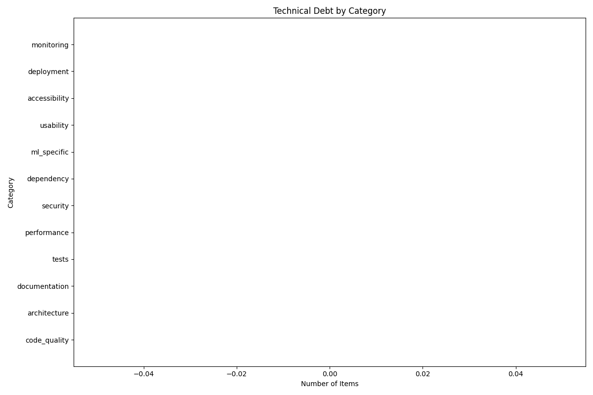

# Technical Debt Dashboard
**Generated on:** 2025-03-06

## Summary Metrics

| Metric              | Value   |
|:--------------------|:--------|
| Total Items         | 0       |
| Critical Items      | 0       |
| High Severity Items | 0       |
| Debt Density        | 0.00%   |
| ML-Specific Items   | 0       |

**Project Debt Score:** 0.00/10.0 (Excellent)

## Technical Debt Inventory

No technical debt items found.
## Debt Trends

### Debt by Severity

### Debt by Category

## Recommendations

- Based on research, allocate 20% of development time (1 day per week) to systematic debt reduction.
- Consider a dedicated debt-reduction sprint every quarter to address accumulated technical debt.

## Next Debt Reduction Sprint

| ID | Title | Estimated Effort | Category | Severity |
|---|-------|------------------|----------|----------|
